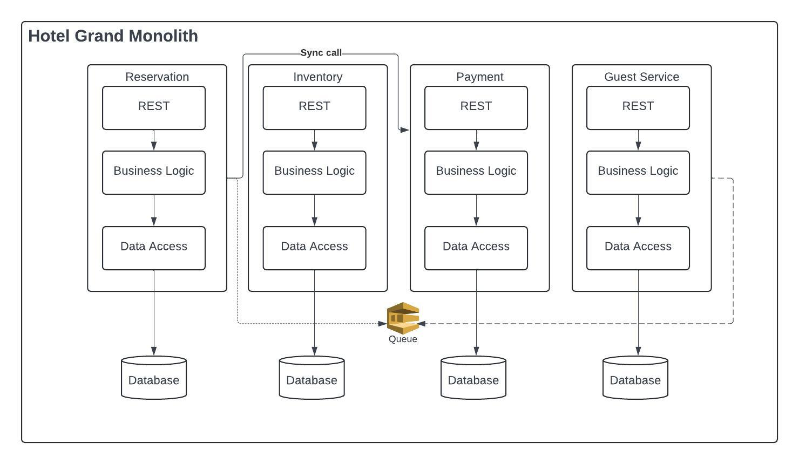

= Hotel Grand Monolith

Welcome to the Hotel Grand Monolith, where our code is as cozy as our beds! In this delightful repository,
we've whipped up a snazzy https://spring.io/projects/spring-modulith[Spring Modulith] based hotel booking/reservation application that's as flexible as it is fabulous

Embracing the modular monolith approach, our codebase is like a trusty Swiss army knife –
versatile, efficient, and ready to spring into action whenever you need it. And hey, if you ever
decide to go 'microservices mad,' we've laid the groundwork for a seamless transition.
So grab your virtual suitcase and let's dive into the world of hotel bookings, one monolith at a time!

== Sequence Diagram:

== Module Diagram:

== Mission Statement

When embarking on a new project, whether it be structured as a monolith, microservices architecture,
or an enhanced modular monolith approach, two critical considerations must be addressed:

Firstly, ensuring the fidelity of the project's implementation to the original architectural design.

Secondly, establishing comprehensive observability mechanisms.

These measures not only uphold architectural integrity but also facilitate effective monitoring and
analysis throughout the project lifecycle, enhancing overall performance and maintainability.

=== If circular dependencies are introduced among modules
`ModularityTests.verifyModularity` reports the following error:

[literal]
....
org.springframework.modulith.core.Violations: - Cycle detected: Slice guest ->
                Slice reservation ->
                Slice guest
  1. Dependencies of Slice guest
    - Method <hotel.guest.Guest.updateStock(hotel.reservation.Reservation$ReservationCompleted)> has parameter of type <hotel.reservation.Reservation$ReservationCompleted> in (Guest.java:0)
  2. Dependencies of Slice reservation
    - Constructor <hotel.reservation.Reservation.<init>(hotel.guest.Guest$GuestIdentifier)> has parameter of type <hotel.guest.Guest$GuestIdentifier> in (Reservation.java:0)
    - Field <hotel.reservation.Reservation.customer> has generic type <org.jmolecules.ddd.types.Association<hotel.guest.Guest, hotel.guest.Guest$GuestIdentifier>> with type argument depending on <hotel.guest.Guest$GuestIdentifier> in (Reservation.java:0)
    - Field <hotel.reservation.Reservation.customer> has generic type <org.jmolecules.ddd.types.Association<hotel.guest.Guest, hotel.guest.Guest$GuestIdentifier>> with type argument depending on <hotel.guest.Guest> in (Reservation.java:0)
    - Method <hotel.reservation.Reservation.getCustomer()> has generic return type <org.jmolecules.ddd.types.Association<hotel.guest.Guest, hotel.guest.Guest$GuestIdentifier>> with type argument depending on <hotel.guest.Guest$GuestIdentifier> in (Reservation.java:0)
    - Method <hotel.reservation.Reservation.getCustomer()> has generic return type <org.jmolecules.ddd.types.Association<hotel.guest.Guest, hotel.guest.Guest$GuestIdentifier>> with type argument depending on <hotel.guest.Guest> in (Reservation.java:0)
    - Method <hotel.reservation.ReservationManagement.create(hotel.guest.Guest$GuestIdentifier)> has parameter of type <hotel.guest.Guest$GuestIdentifier> in (ReservationManagement.java:0)
....

=== If by some miracle, the implementation aligns perfectly with the original design
a boringly beautiful output!

[literal]
....
# Guest
> Logical name: guest
> Base package: hotel.guest
> Direct module dependencies: none
> Spring beans: none

# Reservation
> Logical name: reservation
> Base package: hotel.reservation
> Direct module dependencies: none
> Spring beans:
  o ….ReservationRepository

# Inventory
> Logical name: inventory
> Base package: hotel.inventory
> Direct module dependencies: none
> Spring beans:
  o ….InventorySettings

# Housekeeping
> Logical name: housekeeping
> Base package: hotel.housekeeping
> Direct module dependencies: none
> Spring beans: none

# Payment
> Logical name: payment
> Base package: hotel.payment
> Direct module dependencies: none
> Spring beans:
  o ….PaymentRepository

Process finished with exit code 0
....

TBD(Trunk-Based Development) doesn't seem to be scary anymore?

== What's next?

=== Observability

Ah, now it's time to embrace the magic of observability! Picture this: capturing insights in real-time and locally,
before your latest changes have danced their way to the remote repository.
It's like uncovering hidden treasures before they've even been fully unearthed!

Every developer yearns to grasp the inner workings of the systems they build, yet time and resources often stand in the way. With Spring team's latest enhancements, they've empowered us with observability for Spring applications. Through a myriad of autoconfigurations, they've seamlessly integrated enhanced metrics with Micrometer and introduced new distributed tracing support with Micrometer Tracing. It's like they've waved a magic wand, making observability readily accessible at the snap of our fingers. Kudos to the Spring team for illuminating the path to better understanding!

Stunning Service Graph

image::img/apm-service-graph-web.png[]

=== Locust Load Test

Who says load testing can't be fun? Picture this: load testing your masterpiece locally, with the power of Docker at your fingertips. You deploy your sleek modular monolith pods, orchestrating them into a mighty cluster complete with load balancing—all within the cozy confines of your local environment. It's like staging a grand performance right in your own backyard! With this setup, you're uncovering and squashing bugs before they even think about sneaking into the remote repository. Talk about proactive problem-solving at its finest!

=== REST APIs

We're about to sprinkle some REST API magic on these modules and turn them into microservice rockstars!
